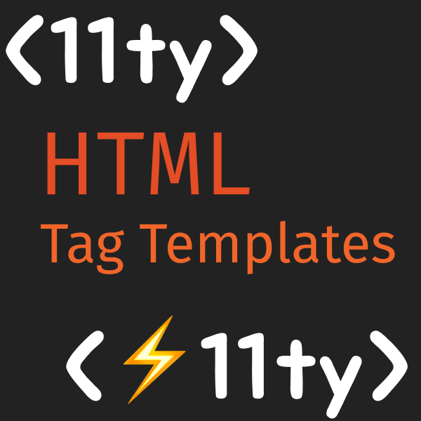

# Eleventy HTML Tag Templates Plugin


[](https://badge.fury.io/js/eleventy-html-tag-templates)

**Author:** David Yue  
**GitHub:** https://github.com/CoconutJJ/eleventy-html-tag-templates-plugin

Transform your Eleventy templates with custom HTML tags that expand into regular
HTML during build time. Think of it as a lightweight, template-focused
alternative to React JSX components.

## Why Use This Plugin?

While Eleventy's shortcodes excel at logic-heavy templates, HTML Tag Templates
shine for markup and style-heavy components. This plugin makes it natural to add
properties, classes, and IDs to your templates without the visual clutter that
comes with repeated shortcode usage in HTML.

## Installation

You can install this package with `pnpm`

```sh
$ pnpm add eleventy-html-tag-templates
```

`npm` and `yarn` should work as well.

## Quick Start

Configure your `.eleventy.js` file:

```js
import { HTMLTagTemplates } from "eleventy-html-tag-templates";
import Nunjucks from "nunjucks";

export default function (eleventyConfig) {
  // Set up Nunjucks environment
  let nunjucksEnvironment = new Nunjucks.Environment(
    new Nunjucks.FileSystemLoader("src/_includes")
  );

  // Optional: Enable custom Nunjucks features from your Eleventy config
  eleventyConfig.setLibrary("njk", nunjucksEnvironment);

  const htmlTagTemplates = new HTMLTagTemplates();

  eleventyConfig.addPlugin(htmlTagTemplates.eleventyPlugin(), {
    tagTemplateDirectory: "path/to/templates/dir",
    nunjucksEnvironment: nunjucksEnvironment,
    styleSheetPreprocessor: (filepath) => {
      return readFileSync(filepath);
    },
  });
}
```

## Creating Tag Templates

### Basic Templates

Create a Nunjucks file in your templates directory. The filename becomes the tag
name:

**File:** `button.njk`
```html
<button class="btn">{{ label }}</button>
```

**Usage:**
```html
<button label="Click me" />
```

### Custom Tag Names

Override the default tag name using frontmatter:

```html
---
tag: "PrimaryButton"
---
<button class="btn btn-primary">{{ label }}</button>
```

**Usage:**
```html
<PrimaryButton label="Submit" />
```


### Template Structure Rules

Each tag template must have exactly one root element:

**❌ Invalid - Multiple root elements:**
```html
<div class="left">{{ title }}</div>
<div class="right">{{ description }}</div>
```

**✅ Valid - Single root element:**
```html
<div class="container">
  <div class="left">{{ title }}</div>
  <div class="right">{{ description }}</div>
</div>
```

## Advanced Features

### Paired Tags with Content

Create templates that wrap content using the special `content` variable:

**Template:**
```html
---
tag: "Card"
---
<div class="card">
  <h2>{{ title }}</h2>
  <div class="card-body">{{ content }}</div>
</div>
```

**Usage:**
```html
<Card title="Welcome">
  <p>This content goes inside the card body.</p>
</Card>
```

### Nested Tag Templates

Tag templates support unlimited nesting levels, allowing you to create complex
template hierarchies. You can nest templates in two ways:

1. **Within template definitions** - When creating your template structure
2. **During template usage** - Within the content wrapped by paired tags

> [!WARNING]
> **Exercise caution with nested templates.** This plugin cannot detect infinite
> recursion loops in your templates. Since Nunjucks supports arbitrary logic
> within templates, it's theoretically impossible to automatically detect
> whether a template will cause infinite recursion (this is known as the halting
> problem). Currently, no recursion detection is implemented, so infinite loops
> will cause your application to hang or crash.

### Integrated CSS Styling

Attach stylesheets directly to your templates:

```html
---
tag: "Hero"
stylesheet: "src/_includes/css/hero.css"
---
<section class="hero">
  <h1>{{ title }}</h1>
  <p>{{ subtitle }}</p>
</section>
```

The stylesheet automatically gets injected into the `<head>` of pages that use
this template. Unused templates won't add unnecessary CSS to your pages.

### CSS Preprocessor Support

Use SASS, LESS, or other preprocessors by defining a custom processor function:

```js
// For SASS
eleventyConfig.addPlugin(htmlTagTemplates.eleventyPlugin(), {
  tagTemplateDirectory: "src/_templates",
  nunjucksEnvironment: nunjucksEnvironment,
  styleSheetPreprocessor: (filepath) => {
    return sass.renderSync({ file: filepath }).css.toString();
  },
});
```

## Attribute Forwarding

You can automatically forward all or a select number of attributes using the
`forward()` nunjucks template function

```xml
<Tag label="a" name="b" />
```
with template definition
```xml
<AnotherTag {{ forward('label', 'name') }} />
```

The expansion will be 

```xml
<AnotherTag label="a" name="b" />
```

If no argument are passed to `forward`, it will forward all attributes passed.
You can also selectively exclude attributes from being forwarded. This is done
using the `!` symbol before the attribute name. To do this you first need
to tell `forward` to include all attributes explicitly using `*`. This example 
shows how to forward all attributes except `label`.

```xml
<AnotherTag {{ forward('*', '!label') }} />
```


## Configuration Options

| Option | Type | Description |
|--------|------|-------------|
| `tagTemplateDirectory` | string | Path to your tag template files |
| `nunjucksEnvironment` | Nunjucks.Environment | Nunjucks environment for rendering |
| `styleSheetPreprocessor` | function | Optional CSS preprocessor function |

## Best Practices

1. **Keep templates focused** - Each template should represent a single,
   reusable component
2. **Use semantic filenames** - Template filenames should clearly indicate their
   purpose
3. **Leverage CSS integration** - Colocate styles with templates for better
   maintainability
4. **Take advantage of attribute forwarding** - Design templates to work
   naturally with standard HTML attributes
5. **Consider template composition** - Use paired tags to create flexible,
   composable components

## Example: Complete Component

**File:** `src/_templates/alert.njk`
```html
---
tag: "Alert"
stylesheet: "src/_includes/css/alert.css"
---
<div class="alert alert-{{ type || 'info' }}" role="alert">
  
    <h4 class="alert-title">{{ title }}</h4>
  
  <div class="alert-content">{{ content }}</div>
</div>
```

**Usage:**
```html
<Alert type="warning" title="Important Notice" class="mb-4">
  Please review the terms before proceeding.
</Alert>
```

This creates a flexible, styled alert component that integrates seamlessly with
your existing HTML and CSS workflow.